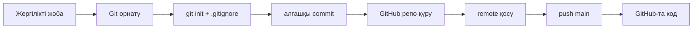

# FOCUS.bm — GitHub-қа жүктеу схемасы

## Жалпы схема (процесс)



## 0. Папкалар репоға «кірмейді» ме?

Git **бос қалтаны** сақтамайды — тек файлдарды. Сондай-ақ `node_modules` `.gitignore`-да. Толығырақ: **[TROUBLESHOOT_GIT.md](./TROUBLESHOOT_GIT.md)**.

## 1. Дайындық (бір рет)

1. **[Git for Windows](https://git-scm.com/download/win)** орнатыңыз (немесе `winget install Git.Git`).
2. **[GitHub](https://github.com)** аккаунтыңызбен кіріңіз.
3. Жобада құпия деректер **жоқ** екеніне көз жеткізіңіз: `.env` файлдары `.gitignore`-да (репоға кірмейді). Жаңа машинада `.env` қолмен `.env.example` бойынша құрасыз.

## 2. GitHub-та бос репозиторий

1. GitHub → **New repository**.
2. Атау мысалы: `FOCUS.bm` (немесе `focus-bm`).
3. **Public** немесе **Private** таңдаңыз.
4. README / .gitignore **қоспаңыз** (жобада бар болса), сосын **Create repository**.

## 3. Терминал командалары (жоба қалтасында)

`FOCUS.bm` қалтасында PowerShell немесе Git Bash:

```bash
git init
git add .
git commit -m "Initial commit: FOCUS.bm MVP"
git branch -M main
git remote add origin https://github.com/СІЗДІҢ_ЛОГИН/РЕПО_АТЫ.git
git push -u origin main
```

- `СІЗДІҢ_ЛОГИН` — GitHub username.
- `РЕПО_АТЫ` — жаңа құрған репозиторий атауы.

**Ескерту:** алғаш `git push` кезінде GitHub логин/пароль орнына **Personal Access Token (PAT)** керек болуы мүмкін: GitHub → Settings → Developer settings → Personal access tokens.

## 4. SSH (қалау бойынша)

Кілтпен жұмыс істегіңіз келсе:

```bash
ssh-keygen -t ed25519 -C "email@example.com"
```

Жария кілтті (`*.pub`) GitHub → Settings → SSH keys-ке қосыңыз. Содан кейін:

```bash
git remote set-url origin git@github.com:ЛОГИН/РЕПО.git
git push -u origin main
```

## 5. Келесі реттерде өзгерістер жіберу

```bash
git add .
git commit -m "Қысқаша сипаттама"
git push
```

## 6. Не жүктелмеу керек

`.gitignore` арқылы елемейді (қауіпсіздік):

- `node_modules/`
- `*.db` (SQLite)
- `.env`

Осы файлдарды GitHub-ға **салмаңыз**.

---

## Қысқа блок-схема (тізбек)

| Қадам | Әрекет |
|------|--------|
| 1 | Git орнату |
| 2 | GitHub-та жаңа repo |
| 3 | `git init` → `add` → `commit` |
| 4 | `remote add` + `push` |
| 5 | Шолу: github.com/…/FOCUS.bm |

Осы схема бойынша репозиторий дайын болады.
