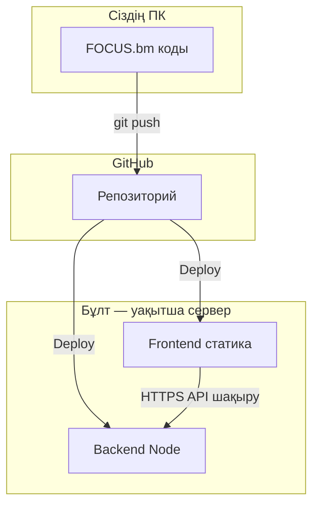

# Туториал: GitHub + уақытша «сервер» (хостинг)

## Маңызды түсінік

| Не | Не істейді |
|----|------------|
| **GitHub** | Код сақтайды, нұсқа тарихы, ынтымақтастық. Бұл **веб-сервер емес** — Node.js API-ны үздіксіз іске қоспайды. |
| **GitHub Pages** | Тек **статикалық** файлдар (HTML/CSS/JS build). Express, WebSocket, SQLite жұмыс істемейді. |
| **Уақытша нақты сервер** | Кодты GitHub-тан алып, **Render / Railway / Fly.io** сияқты **PaaS** іске қосады. |

Сіздің «GitHub арқылы сервер» деген тілек — дұрыс жол: **репозиторий GitHub-та**, **орындау (deploy)** тегін немесе арзан хостингте. Төменде ең түсінікті нұсқа: **GitHub → push**, содан кейін **Render** (мысалы) GitHub-тан build жасайды.



---

## Бөлім 1. Git орнату және бірінші push

### 1.1 Git орнату

1. [Git for Windows](https://git-scm.com/download/win) жүктеп орнатыңыз.  
   Немесе PowerShell: `winget install Git.Git`

2. Терминалды жабып ашыңыз, тексеріңіз:

```bash
git --version
```

### 1.2 GitHub аккаунты және токен (HTTPS үшін)

1. [github.com](https://github.com) — тіркелу / кіру.
2. **Settings** → **Developer settings** → **Personal access tokens** → **Tokens (classic)**.
3. **Generate new token** — галочка: `repo` (толық репо қолжетімділігі).
4. Токенды **бір рет** көшіріп сақтаңыз (қайта көрсетілмейді). Бұл құпия кілт сияқты.

`git push` кезінде **құпия сөз** орнына осы **токенді** енгізесіз (немесе Git Credential Manager сақтайды).

### 1.3 Жергілікті жобада Git баптау (бір рет)

PowerShell, жоба қалтасы `FOCUS.bm`:

```bash
cd "C:\Users\...\Desktop\...\FOCUS.bm"

git config --global user.name "Сіздің атыңыз"
git config --global user.email "github@email.com"
```

### 1.4 Репозиторий құру және push

1. GitHub-та: **New repository** → атау: мысалы `FOCUS.bm` → **Create** (README қоспауға болады, жобада бар).

2. Жергілікті:

```bash
git init
git add .
git commit -m "Initial commit: FOCUS.bm MVP"
git branch -M main
git remote add origin https://github.com/ЛОГИН/FOCUS.bm.git
git push -u origin main
```

`ЛОГИН` — сіздің GitHub username.  
Егер сұраса: **Username** = логин, **Password** = **PAT токен**.

Тексеру: браузерде `https://github.com/ЛОГИН/FOCUS.bm` — файлдар көрінуі керек.

### 1.5 Кейінгі өзгерістер

```bash
git add .
git commit -m "Сипаттама"
git push
```

`.env`, `*.db` репоға кірмейді (`.gitignore`) — дұрыс.

---

## Бөлім 2. GitHub — сервер емес; уақытша онлайн қалай ашу

### 2.1 Неге тек GitHub жеткіліксіз

FOCUS.bm: **Node.js + Express + Prisma + Socket.IO**. Мұндай қосымшаны **GitHub Pages** іске қоса алмайды.  
**Шешім:** GitHub-та код сақталады; **орындау** үшін Render (немесе ұқсас) қолданылады.

### 2.2 Архитектура (уақытша)

- **Backend** — бұлтта Web Service (мысалы Render): `npm run build`, `node dist/index.js`, `prisma`.
- **Frontend** — статикалық build (`npm run build` → `dist`), GitHub Pages немесе Render Static Site / Vercel.
- **Frontend** қоршау айнымалысы: `VITE_API_URL` = backend URL (толық HTTPS), мысалы `https://focus-api.onrender.com`.

Кодта қолдау: `frontend` — `VITE_API_URL` арқылы API және WebSocket базасы.

### 2.3 Render — backend (мысалы)

1. [render.com](https://render.com) — GitHub арқылы кіру.
2. **New** → **Web Service** → репозиторийді таңдаңыз.
3. **Root Directory:** `backend`
4. **Build Command:**

```bash
npm install && npx prisma generate && npx prisma db push && npm run build
```

5. **Start Command:**

```bash
node dist/index.js
```

6. **Environment** (мысалы):

| Кілт | Мағынасы |
|------|-----------|
| `DATABASE_URL` | `file:./data.db` (немесе Render-да файл жолы; тегін тарифте диск уақытша болуы мүмкін) |
| `JWT_SECRET` | ұзын кездейсоқ жол |
| `CLIENT_ORIGIN` | frontend URL (мысалы `https://логин.github.io` немесе Vercel URL) |

**Ескерту:** тегін Render instance **ұйықтауы** мүмкін — бірінші сұрау баяу. SQLite тегін дискіде **қайта іске қосқанда** дерек жоғалуы мүмкін — тек демо үшін; тұрақты үшін **PostgreSQL** қосу керек.

Backend URL шыққаннан кейін оны жазып алыңыз: мысалы `https://focus-bm-api.onrender.com`.

### 2.4 Frontend — build және `VITE_API_URL`

Жергілікті немесе CI-да:

```bash
cd frontend
set VITE_API_URL=https://СІЗДІҢ-API.onrender.com
npm install
npm run build
```

Немесе `.env.production` (GitHub-ға **қоспаңыз**, құпия емес бұл — тек API URL):

```
VITE_API_URL=https://СІЗДІҢ-API.onrender.com
```

`dist/` қалтасын **GitHub Pages** (Settings → Pages → branch `gh-pages` немесе Actions) немесе **Vercel** / **Netlify** арқылы жариялаңыз.

**CORS:** backend `.env` ішінде `CLIENT_ORIGIN` дәл сол frontend доменымен сәйкес болуы керек.

---

## Бөлім 3. Қысқа чек-лист

- [ ] Git орнатылды, `git push` жұмыс істейді.
- [ ] GitHub репозиторийде код бар.
- [ ] Backend бұлтта іске қосылды, `/health` жауап береді.
- [ ] `VITE_API_URL` frontend build-ке қойылды.
- [ ] `CLIENT_ORIGIN` backend-те frontend URL-мен сәйкес.

---

## Қосымша: GitHub Actions (кейін)

Автоматты deploy үшін `.github/workflows/deploy.yml` қосуға болады — бұл бөлек қадам; алдымен қолмен Render баптау жеткілікті.

Толық Git командалары: [GITHUB.md](./GITHUB.md).
